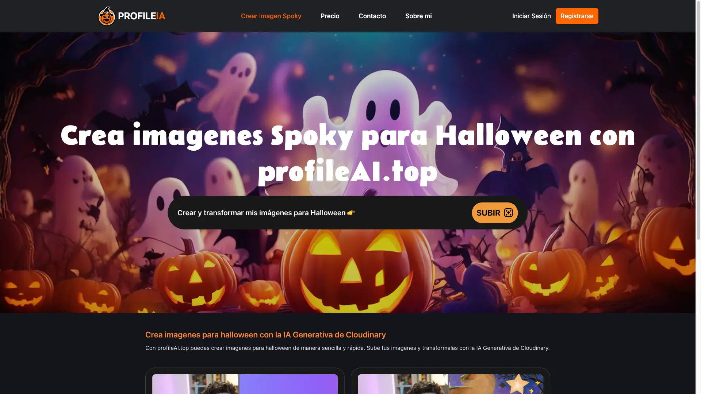

ProfileAI.TOP 🎨✨
=================

**ProfileAI.TOP** es una aplicación que utiliza el poder de la inteligencia artificial de Cloudinary para transformar tus imágenes de una manera increíble. ¡Cambia el fondo, la ropa, aplica filtros y ajusta el tamaño a tu gusto en solo unos clics! 🎃👻

Este proyecto ha sido desarrollado como parte de la [Cloudinary CloudCreate Spooky AI Hackathon](https://cloudinary.com/blog/cloudinary-cloudcreate-spooky-ai-hackathon) organizada por [midudev](https://x.com/midudev).

Características principales 🛠️
-------------------------------

*   **Cambiar el fondo**: Transforma tus fotos con fondos temáticos como fantasmas, calabazas, brujas, murciélagos y más.
*   **Cambiar atuendos**: ¡Convierte a las personas en vampiros, hombres lobo o incluso calabazas con solo un clic!
*   **Filtros especiales**: Dale un toque artístico con filtros en blanco y negro, sepia o un efecto brillante fantasmagórico.
*   **Redimensionar imágenes**: Elige entre formato vertical, horizontal, cuadrado o 3:4.
*   **Galería personalizada**: Regístrate y guarda tus imágenes transformadas en tu galería personal.

Tecnologías utilizadas 💻
-------------------------

*   **Backend**: Laravel + Blade
*   **Autenticación**: Laravel Socialite para Google
*   **Procesamiento de imágenes**: Cloudinary API
*   **Frontend**: Blade templating y estilos personalizados
*   **Generación de imágenes**: Efectos y transformaciones utilizando Cloudinary AI
*   **Contenedores**: Laravel Sail y Docker

Cómo funciona ⚙️
----------------

1.  **Sube tu imagen**: Selecciona una imagen desde tu dispositivo.
2.  **Elige tus transformaciones**:
    *   **Fondos temáticos**: Desde un bosque embrujado con hombres lobo hasta una noche con murciélagos volando.
    *   **Atuendos espeluznantes**: Viste a tus personajes con trajes de Halloween, como zombies, vampiros o arañas.
    *   **Filtros**: Aplica blanco y negro, sepia, o un brillo fantasmal.
3.  **Ajusta el tamaño**: Selecciona el formato adecuado para tu imagen.
4.  **Descarga y guarda**: Descarga tu imagen transformada o guárdala en tu galería personal.

Capturas de pantalla 🖼️
------------------------

Registro e inicio de sesión 🔐
------------------------------

Los usuarios pueden registrarse y acceder a su galería personalizada donde se almacenarán todas sus imágenes transformadas.

> **Nota**: Actualmente, el inicio de sesión con Google no está funcionando en producción. Estamos trabajando para solucionarlo.

Instalación 🚀
--------------

Este proyecto utiliza [Laravel Sail](https://laravel.com/docs/9.x/sail) y Docker para un entorno de desarrollo sencillo. Sigue estos pasos para instalarlo:

1.  Clona el repositorio:
    
    bash
    
    Copiar código
    
    `git clone https://github.com/dovaldev/laravel-cloudinary-hackathon.git cd laravel-cloudinary-hackathon`
    
2.  Copia el archivo `.env.example` y renómbralo a `.env`. Configura tus credenciales de Cloudinary y la base de datos.
    
    bash
    
    Copiar código
    
    `cp .env.example .env`
    
3.  Instala las dependencias:
    
    bash
    
    Copiar código
    
    `./vendor/bin/sail composer install ./vendor/bin/sail npm install`
    
4.  Levanta los contenedores de Docker:
    
    bash
    
    Copiar código
    
    `./vendor/bin/sail up -d`
    
5.  Ejecuta las migraciones y semillas:
    
    bash
    
    Copiar código
    
    `./vendor/bin/sail artisan migrate --seed`
    
6.  Accede al sitio en tu navegador en `http://localhost`.

Cómo contribuir 👥
------------------

Las contribuciones son bienvenidas. Si tienes ideas para nuevas características, mejoras en el diseño o quieres arreglar algún bug, no dudes en hacer un fork del proyecto y enviar tu Pull Request.

Licencia 📜
-----------

Este proyecto está licenciado bajo la MIT License.
